# SLMs&MOE  
created by NDL
<p align="left">
    <a href="README_CN.md">中文</a>&nbsp ｜ &nbspEnglish&nbsp ｜ &nbsp<a href="README_JA.md">日本語</a> ｜ &nbsp<a href="README_FR.md">Français</a> ｜ &nbsp<a href="README_ES.md">Español</a>
</p>
<br><br>
<p align="center">
        🤗 <a href="https://huggingface.co/Ndlcwx">Hugging Face模型主页</a>&nbsp&nbsp | &nbsp&nbsp🤖 <a href="https://modelscope.cn/profile/Ndlcwx">ModelScope模型主页</a>&nbsp&nbsp 
<br>
        
> [!IMPORTANT]
> - 2024.5.22: 加入基于Gradio与FastAPI搭建的聊天机器人功能，支持上传PDF外挂你的本地知识库（RAG），[查看详情](https://github.com/cwxndl/Chat-bot/tree/main)  
> - 安装依赖命令：step1:cd chat-bot ,step2: pip install -r chat-bot-requirement.txt
> - 2024.5.28：更新chatbot 2.0:基于通义千问API以及Langchain 全新构建新的webui框架，支持**多模态对话**，**多轮对话**，**多类型文件输入(PDF,markdown,txt,docx)以及图片输入**,相应更快，回答更准确

- 聊天机器人1.0示例（测试RAG与api端口）
<div align="center">

</div>

- 聊天机器人2.0多轮对话能力示例：
<div align="center">

</div>

- 聊天机器人2.0 PDF处理能力示例：
<div align="center">

</div>

- 聊天机器人2.0 markdown处理能力示例：
<div align="center">

</div>

- 聊天机器人2.0 word处理能力示例：
<div align="center">

</div>

- 聊天机器人2.0 txt处理能力示例：
<div align="center">

</div>

- 聊天机器人2.0 多模态对话处理能力示例：
<div align="center">

</div>

👉 以往项目地址：
- [机器学习算法复现--正在完善](https://github.com/cwxndl/Machine-Learning-By-Python-R-Matlab)
        
- [2023-美赛春季赛解答](https://github.com/cwxndl/2023-MCM-Y)
        
😄本项目支持以下任务：
- 支持预训练
- 支持增量预训练
- 支持监督微调-SFT
- 支持Lora微调

🏡当前已训练好的模型：
- [NDLSLM_0.8B-base](https://modelscope.cn/models/Ndlcwx/NDLSLM_0.8B-base/summary)
- [NDLSLM_0.8B-beta-base](https://modelscope.cn/models/Ndlcwx/NDLSLM_0.8B-beta-base/summary)
- [NDLSLM_0.8B-Chat](https://modelscope.cn/models/Ndlcwx/NDLSLM_0.8B-Chat/summary)
- [NDLSLM_0.8B-Lora-Chat]():待上传
- [NDLSLM_0.8B-beta-Chat](https://modelscope.cn/models/Ndlcwx/NDLSLM_0.8B-beta-Chat/summary)
- [NDLMoe_1.3B-base](https://modelscope.cn/models/Ndlcwx/NDLMoe_1.3B-base/summary)
- [NDLMoe_1.3B-Chat](https://modelscope.cn/models/Ndlcwx/NDLMoe_1.3B-Chat/summary)
- [NDLMoe_1.3B-beta-Chat](https://modelscope.cn/models/Ndlcwx/NDLMoe_1.3B-beta-Chat/summary)
- [基于NDLSLM_0.8B-Chat的Lora-命名实体识别]():待上传
- [使用本项目的SFT框架对Qwen_1.8B-base进行SFT训练的模型](https://modelscope.cn/models/Ndlcwx/qwen_1.8B-SFT/summary):2024-5-10更新

✏️待做任务：
- DPO任务
- 部署框架
- vllm加速框架

**😊推荐使用Modelscope下载本项目的模型**：
```python
# 例如下载本项目的NDLMoe_1.3B-Chat模型到你的本地文件夹
path = <your_path_name>
#模型下载
from modelscope import snapshot_download
model_dir = snapshot_download('Ndlcwx/NDLMoe_1.3B-Chat',cache_dir = path)
```


## 环境依赖
```bash
# 如果想快速开始预训练，这里请先安装需要的pip包
pip install -r requirements.txt
```

## 😉 预训练细节
<font color=Red>如果想直接开启您的预训练，请直接阅读 **数据预处理**以及后面的内容。</font>

### 1.从零训练自己的分词模型
参考项目为：https://github.com/charent/Phi2-mini-Chinese

NLP任务与一般的机器学习任务有所不同，需要处理的是文本数据。利用分词器可以将文本进行合理的分词，这样对于输入的每一段文本，我们都可以将其映射到数值空间内（token_id），而每一个token_id都可以通过embedding转换为稠密的向量作为模型的输入，通过transformer架构中的自注意力机制可以有效地处理token序列中所涵盖的语义信息，因此有必要了解清楚大模型中的分词方法。

根据不同的粒度区分，常见的分词方法有：
- word base:以词为单位，例如：Today is sunday 按照这种分词方法会被分为：[Today ,is,sunday]
- character base:以字符为单位，例如： Today is sunday 按照这种分词方法会被分为：[T,o,d,a,y,i,s,u,n,d,a,y,.]
- subword base:按照词的subword进行分词。如英文Today is sunday. 则会分割成[To,day,is,s,un,day,.]

自GPT2开始，大模型中的常见分词方式为第三种，即以子词的方式进行分词，这里介绍当前预训练大模型中常见的分词方法：Byte Pair Encoding（BPE），本项目中所使用的分词方法也是基于BPE的。

#### 1.1 BPE算法原理

BPE（Byte Pair Encoding）算法是一种数据压缩算法，通过将常见的字符或字符序列合并成新的单元，从而生成一个词汇表，这个词汇表可以包含从单个字符到完整单词的各种长度的单元。

以下是BPE算法的基本步骤：
1. 初始化：将词汇表中的每个字符视为一个单独的单元。对于给定的文本数据，统计每个单元（即字符）的出现频率。
2. 统计频率：遍历文本数据，统计所有相邻单元对（例如字符对）的出现次数。
3. 合并最频繁的单元对：选择出现次数最多的单元对进行合并，形成一个新的单元。更新词汇表，将新单元加入，并删除原来的两个单元。更新所有包含这两个单元的统计信息，用新单元替换它们。
4. 迭代：重复步骤2和3，直到达到预设的词汇表大小或迭代次数。
5. 生成词汇表：在完成所有迭代后，得到的词汇表包含了从单个字符到较长子词单元的各种长度的单元。
6. 编码：使用生成的词汇表对新的文本数据进行编码。这通常意味着将文本拆分成词汇表中的单元序列。

**BPE算法的优点在于**：

1.能够处理未知单词（OOV，Out-of-Vocabulary words），因为即使一个完整的单词不在词汇表中，它的子词单元也可能在词汇表中。2.生成的词汇表大小可控，可以根据需要进行调整。相对于基于规则的分词方法，BPE更加灵活，能够适应不同语言的特点。

#### 1.2 分词器训练（可选）
> 1.分词器训练需要很大的内存。
> 2.本人训练的分词器是在18G语料中进行训练得到的，大约需要600G内存（捂脸），语料主要采样了天工数据集，百度百科，维基百科中英文，因此可以支持中英文语料的分词，最后的词表规模为：60930，结束符为：[EOS],开始符为：[BOS]

```bash
# 如果您想要训练自己的分词器
# step1: 将您的语料数据收集在wiki.txt文本文件中，注意要放在。
# step2:
cd tokenizer_train
python 0_complex2simple.py #用于繁体字转换为简体字
python 1_train_tokenizer.py #训练你的分词器,基于transformers库中的BpeTrainer
```
测试训练好的分词器：
```python
from transformers import AutoModelForCausalLM,AutoTokenizer
tokenizer = AutoTokenizer.from_pretrained('./tokenize_me')
zh_demo = '床前明月光，疑是地上霜。举头望明月，低头思故乡。'
print(tokenizer.tokenize(zh_demo))
print(tokenizer.encode(zh_demo))

'''
['åºĬ', 'åīį', 'æĺİæľĪ', 'åħī', 'ï¼Į', 'çĸij', 'æĺ¯', 'åľ°ä¸Ĭ', 'éľľ', 'ãĢĤ', '举', '头', 'æľĽ', 'æĺİæľĪ', 'ï¼Į', 'ä½İ头', 'æĢĿ', 'æķħ乡', 'ãĢĤ']
[2693, 559, 29962, 1013, 249, 2725, 299, 9807, 12776, 256, 1391, 1116, 1432, 29962, 249, 39922, 1414, 20327, 256]
'''
en_demo = 'what can I say? Mamba out!'
print(tokenizer.tokenize(en_demo))
print(tokenizer.encode(en_demo))
'''
['wh', 'at', 'Ġcan', 'ĠI', 'Ġsay', '?', 'ĠM', 'amba', 'Ġout', '!']
[6662, 297, 2655, 539, 18606, 37, 437, 40618, 2159, 7]
'''

code_demo = 'import numpy as np\nimport matplotlib.pyplot as plt\nimport pandas as pd\nimport torch\n'
print(tokenizer.tokenize(code_demo))
print(tokenizer.encode(code_demo))
'''
['im', 'port', 'Ġnum', 'py', 'Ġas', 'Ġn', 'p', '\n', 'im', 'port', 'Ġmat', 'pl', 'ot', 'l', 'ib', '.', 'py', 'pl', 'ot', 'Ġas', 'Ġpl', 't', '\n', 'im', 'port', 'Ġpand', 'as', 'Ġas', 'Ġp', 'd', '\n', 'im', 'port', 'Ġtor', 'ch', '\n']
[586, 1525, 2810, 42627, 640, 544, 86, 60929, 586, 1525, 5378, 1737, 550, 82, 1522, 20, 42627, 1737, 550, 640, 962, 90, 60929, 586, 1525, 21377, 347, 640, 350, 74, 60929, 586, 1525, 22572, 600, 60929]
'''
```

> 上面的分词器是基于transformers库进行训练的，关于BPE算法的代码已经被官方集成好了，如果你想了解如何使用python 实现BPE算法，详细的步骤代码见 **tokenizer_train/分词器（tokenize）.ipynb**


### 2. 模型: Transformer Decoder-only 框架
在MOE框架诞生之前，大模型的基本框架大部分都是基于如下的结构（以Llama2为例）

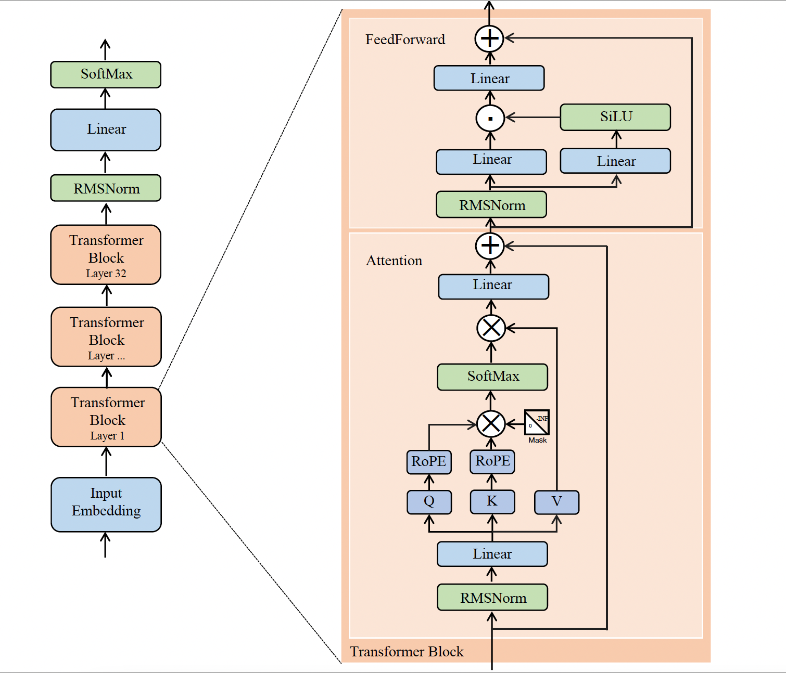


以每个decoder层为例，其内部分别又含有自注意力层（self-attention）以及FFN层，其中自注意力层可以计算每个token之间的相关性，即不同的句子所表达的不同的语义信息；FFN层通过使用引入三个Linear块以及SiLU激活函数，以此来挖掘序列中的token涵盖的更多的语义信息。

具体的模型细节请看model/modeling_ndl.py,里面大部分代码已经进行注释。
### 3.模型: Transformer Decoder-only MOE 框架


MOE模型的相关参考内容：
- [Deepseek—MOE](https://arxiv.org/abs/2401.06066)
- [Hugging-face MOE介绍](https://huggingface.co/blog/zh/moe)

MOE模型最大的特点是具有**稀疏性质**，将传统开源大模型中的FFN层替换为稀疏的MOE层，在每个MOE层中会有一个门控单元（Router），通过训练一个类似于分类器的门控单元，从而决定当前的token到底输入到哪个专家（通常是缩小版的FFN）【在token分配给专家之前，会对每个专家对该token的“贡献值”进行打分（位于0-1之间），最后选择top_k个专家分别对输入的Token进行输出】，普通的MOE结构如下：
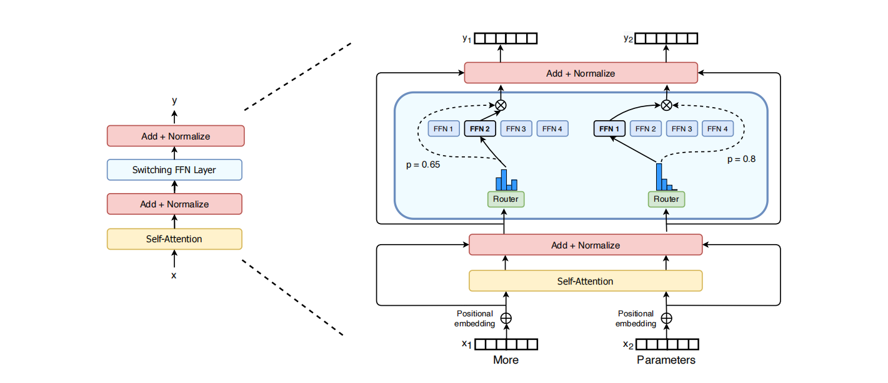

Deepseek-Moe对传统的MOE做出以下改变：
- 设置更细粒度的专家
- 设置共享专家（shared experts）
- 除了设置专家均衡辅助损失函数以外，还设置了针对多机多卡训练的设备均衡损失函数

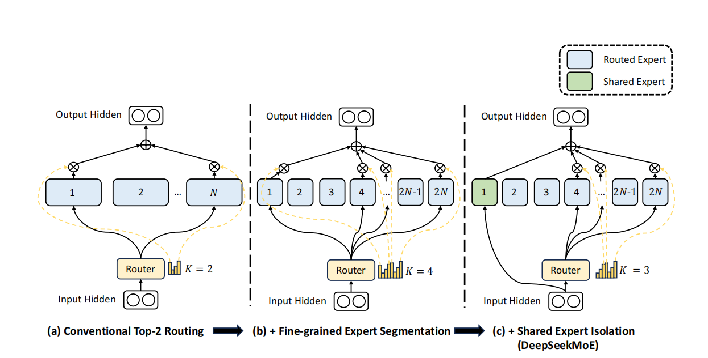
### 4. 📘 训练步骤
#### 4.1 数据下载：
- [天工数据集](https://modelscope.cn/datasets/modelscope/SkyPile-150B/files):由于天工数据集较多，这里推荐使用git lfs 进行安装:
```bash 
sudo apt update
sudo apt install git-lfs
git clone https://www.modelscope.cn/datasets/modelscope/SkyPile-150B.git
```
- [维基百科中文数据集](https://huggingface.co/datasets/pleisto/wikipedia-cn-20230720-filtered)
- [维基百科英文数据集]()
- [github_code数据集](https://huggingface.co/datasets/codeparrot/github-code-clean/tree/main/data)
- [百度百科数据集](https://huggingface.co/datasets/xuqinyang/BaiduBaike-5.63M/tree/main)

#### 4.2 数据预处理：
预训练base模型最终的目的是让模型具有**续写能力**，但不可能让模型一直不断地续写下去，因此需要再每一段结束的文本后加入结束符号，本项目的文本结束符号为'[EOS]',这样模型在训练的过程中会知道什么时候是句子的结束部分。

这里我参考的是：https://github.com/jiahe7ay/MINI_LLM/tree/main 中的数据预处理方法，该博主的数据预处理方法主要有以下几点：
- 节省内存，将预处理好的数据保存为parquet格式能够有效的节省你的内存空间
- 分词后的token_id会自动缓存在.cache文件夹内，这样有利于进行断点训练或者重新训练，不会因为意外发生OOM或者程序出错要重新进行分词，给作者点赞。

```bash
# 快速开始：
# 首先要先下载您需要的数据到相应的文件夹中
cd utils
python data_preprocess.py
#gen_sky('/root/autodl-tmp/sky_new','/root/autodl-tmp/data/sky_new')
# 以处理天工数据集为例：你需要先将天工数据集下载至文件夹：sky_new内，最终预处理后的数据保存在data/sky_new下面
```

#### 4.3 预训练-NDLSLM_0.8B-base
该模型的具体细节见Modelscope：https://modelscope.cn/models/Ndlcwx/NDLSLM_0.8B-base/summary

本次预训练的主要特点有以下几点：
- **支持bf16与float32混合精度训练**，在RMSNorm与ROPE处采用flaot32,部分前向传播与反向传播采用bf16，以此平衡内存与精度。
  - float16:一位符号位（代表正负），五位指数位（代表范围），十位尾数，代表了精度。因此float16所表示的数据精度较低
  - float32:一位符号位（代表正负），八位指数位（代表范围），23位尾数，代表了精度。因此float32所能表示的数据范围更大，精度更高
  - bfloat16:一位符号位（代表正负），但是可以表示和float32一样的八位指数，七位尾数。因此bfloat16可以表示的数据范围与float32相同，但是精度低于float16以及float32.

- **支持NTK缩放**

- **支持GQA、MQA**

- **支持在RMSNorm使用flash-attn加速计算**


**如果您打算从零开始预训练NDLSLM_0.8B-base模型**：
>预训练之前请根据您的GPU数量情况更 accelerate_multi_gpu.yaml中的num_processes数量

- 如果您想修改模型的配置如：hidden_dim,decoder_layers,intermediate_dim等，请直接在model_config.py进行修改，修改后可以运行相应的model文件查看您修改的配置对应的模型参数大小：
```python
python modeling_ndl.py #会输出该模型的参数量大小
```
当确定好您的模型具体参数以及GPU数量设置，执行下面的bash命令进行预训练：
```bash
bash run_pretrain.sh
```
- 如果您想在我的模型基础上进行增量预训练：
```python
# 首先要将NDLSLM_0.8B模型下载至目录：/autodl-tmp/model_save/0_8B_base,下载方法：
from modelscope import snapshot_download
import os
path = '/root/autodl-tmp/model_save/0_8B_base'
if os.path.exists(path):
    pass
else:
    os.mkdir(path)
model_dir = snapshot_download('Ndlcwx/NDLSLM_0.8B-base',cache_dir = path)
```
模型下载之后，添加您自己的数据集，执行下面的脚本即可进行增量预训练：
<font color=Red>注意</font>：增量预训练的模型参数需要和原模型相同。
```bash
# 建议您选择的数据为：天工数据集
bash run_ex_pretrain.sh
```

#### 4.4 NDLSLM_0.8B-base 预训练损失下降情况

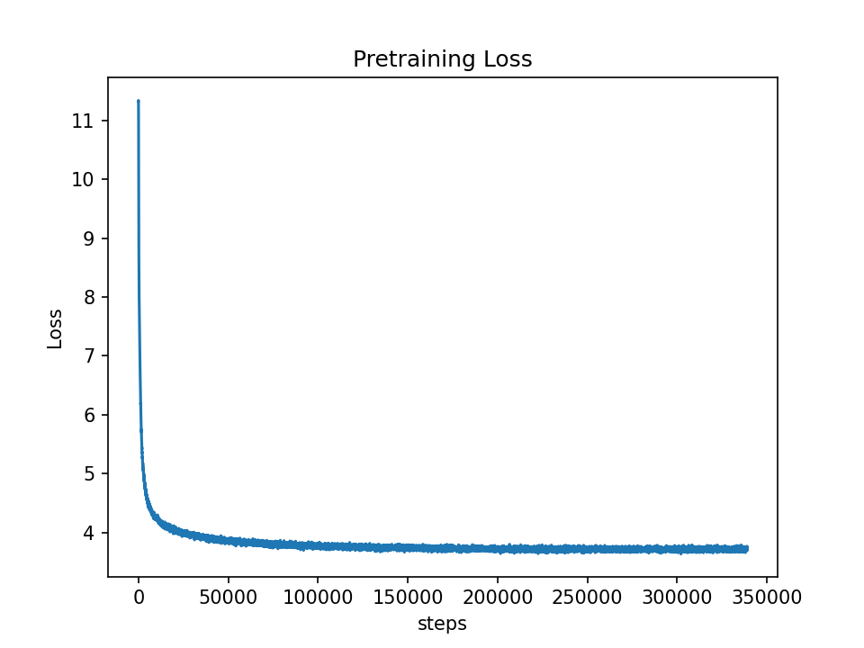

#### 4.5 NDLSLM_0.8B-base 续写能力测试
```python

from modelscope import AutoModelForCausalLM, AutoTokenizer
from modelscope import GenerationConfig
tokenizer = AutoTokenizer.from_pretrained("Ndlcwx/NDLSLM_0.8B-base", trust_remote_code=True)
model = AutoModelForCausalLM.from_pretrained("Ndlcwx/NDLSLM_0.8B-base", device_map="auto", trust_remote_code=True).eval()
from transformers import GenerationConfig
gen_config = GenerationConfig(
    temperature=0.9,
    top_k=30,
    top_p=0.5,
    do_sample=True,
    num_beams=1,
    repetition_penalty=1.3,
    max_new_tokens=400,
    eos_token_id=tokenizer.eos_token_id,
    pad_token_id=tokenizer.pad_token_id,
)
prompt= '黑龙江 、吉林'
import torch
device = 'cuda'
tokend = tokenizer(prompt)
input_ids, attention_mask = torch.LongTensor([tokend.input_ids]).to(
        device
    ), torch.LongTensor([tokend.attention_mask]).to(device)
outputs = model.generate(
        inputs=input_ids, attention_mask=attention_mask, generation_config=gen_config
    )
outs = tokenizer.decode(outputs[0].cpu().numpy())
# outs = outs.replace(prompt,'')
outs = outs.replace('[EOS]','')
print("当前SLM回答:",outs)
'''
黑龙江 、吉林东部、江苏北部等地部分地区降大雨或暴雨，四川成都和眉山、安徽阜阳、河南新乡、内蒙古呼伦贝尔等局地大暴雨（100～170毫米），盐城局地236毫米（最大小时降雨量108毫米）。 二、重点天气预报 1.江淮江汉等地有强降雨 8月27日至28日，江淮、江南东北部、西南地区东南部、重庆南部、湖北中部、苏皖中北部、内蒙古东北部、黑龙江东部和西北部等地的部分地区有大到暴雨（50～90毫米）。上述地区局地并伴有短时强降水、雷暴大风等强对流天气，最大小时降雨量20～40毫米。为此，中央气象台8月26日06时继续发布台风蓝色预警（图1）。 图1 全国强降雨落区预报图（8月27日08时-28日08时） 2.东北地区大部有降水过程 受高空槽和低涡切变的影响，未来三天，新疆南疆盆地和中西部偏南、西北地区中东部、甘肃陇东、陕西中部等地有中到大雨，其中，浙江西部、贵州西北部、云南西南部、湖南西北部、贵州北部、广西北部、广东北部以及海南岛等地的部分地区有大雨（25～35毫米）。青海西北部、西藏西双版纳中南部、辽宁中部等地有4～5级风（见图2）。 图2 全国降水量预报图（8月27日08时-29日08时） 3.主要气象要素与天气预测情况 （一）当前冷空气活动较为频繁，影响时间较长；
'''
```

#### 4.6 预训练-NDLMoe_1.3B-base


本项目中的NDLMoe_1.3B-base模型借鉴DeepSeek-Moe的模型思路，其主要参数如下：

| Hyperparameter  |  Value |
|:----------------|:-------|
|    n_layers     |     12 |
|     n_heads     |     32 |
|     d_model     |   1600 |
| n_shared_experts|  2     |
|n_routed_experts |15|
|num_experts_per_tok| 4|
|intermediate_size|14336|
|moe_intermediate_size|1024|
|   vocab size    | 60930 |
| sequence length |   512 |
|first_k_dense_replace|1 |

更直观的参数描述：
```python
NDLMOEForCausalLM(
  (model): NDLMOEModel(
    (embed_tokens): Embedding(60930, 1600)
    (norm): NDLMOEFlash_attnRMSNorm()
    (layers): ModuleList(
      (0): NDLMOEDecoderlayer(
        (self_attn): NDLSdpaAttention(
          (q): Linear(in_features=1600, out_features=1600, bias=False)
          (k): Linear(in_features=1600, out_features=1600, bias=False)
          (v): Linear(in_features=1600, out_features=1600, bias=False)
          (o): Linear(in_features=1600, out_features=1600, bias=False)
          (rotary_emb): NDLMOERotryEmbedding()
        )
        (mlp): NDLFFN(
          (ffn1_proj): Linear(in_features=1600, out_features=14336, bias=False)
          (ffn2_proj): Linear(in_features=1600, out_features=14336, bias=False)
          (o_proj): Linear(in_features=14336, out_features=1600, bias=False)
        )
        (input_layernorm): NDLMOEFlash_attnRMSNorm()
        (post_attention_layernorm): NDLMOEFlash_attnRMSNorm()
      )
      (1-11): 11 x NDLMOEDecoderlayer(
        (self_attn): NDLSdpaAttention(
          (q): Linear(in_features=1600, out_features=1600, bias=False)
          (k): Linear(in_features=1600, out_features=1600, bias=False)
          (v): Linear(in_features=1600, out_features=1600, bias=False)
          (o): Linear(in_features=1600, out_features=1600, bias=False)
          (rotary_emb): NDLMOERotryEmbedding()
        )
        (mlp): NDLMoE(
          (experts): ModuleList(
            (0-14): 15 x NDLFFN(
              (ffn1_proj): Linear(in_features=1600, out_features=1024, bias=False)
              (ffn2_proj): Linear(in_features=1600, out_features=1024, bias=False)
              (o_proj): Linear(in_features=1024, out_features=1600, bias=False)
            )
          )
          (gate): NDLMoEGate()
          (shared_experts): NDLFFN(
            (ffn1_proj): Linear(in_features=1600, out_features=2048, bias=False)
            (ffn2_proj): Linear(in_features=1600, out_features=2048, bias=False)
            (o_proj): Linear(in_features=2048, out_features=1600, bias=False)
          )
        )
        (input_layernorm): NDLMOEFlash_attnRMSNorm()
        (post_attention_layernorm): NDLMOEFlash_attnRMSNorm()
      )
    )
  )
  (lm_head): Linear(in_features=1600, out_features=60930, bias=False)
)
```

> 该模型总参数量为1.3B，共有12层decoder，除第一层以外均替换为MOE层，每个MOE层共设置15个待激活的专家，2个共享专家，每次激活4个专家。
> 激活参数量约为：0.5B（Non embedding） 

该模型的具体细节：https://modelscope.cn/models/Ndlcwx/NDLMoe_1.3B-base/summary

- 如果您打算从零开始预训练NDLMoe_1.3B-base模型：
>预训练之前请根据您的GPU数量情况更 accelerate_multi_gpu.yaml中的num_processes数量

- 开启MOE模型预训练：
```bash
step1:在moe_pretrain.py中添加您需要预训练的数据集
step2:设置 run_moe_pretrain.sh中的训练参数：batch_size,accumulation_steps等
step3:linux终端运行：
bash run_moe_pretrain.sh
```

#### 4.7 NDLMoe_1.3B-base 预训练损失下降情况
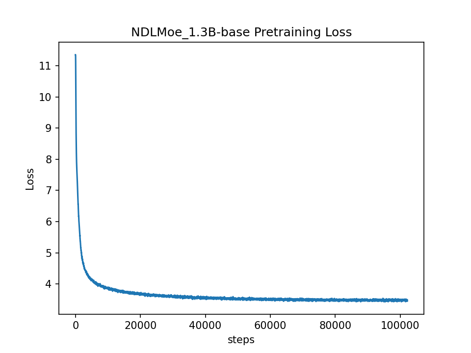

#### 4.8 NDLMoe_1.3B-base 续写能力测试
```python
from modelscope import AutoModelForCausalLM, AutoTokenizer
from modelscope import GenerationConfig
tokenizer = AutoTokenizer.from_pretrained("Ndlcwx/NDLMoe_1.3B-base", trust_remote_code=True)
model = AutoModelForCausalLM.from_pretrained("Ndlcwx/NDLMoe_1.3B-base", device_map="auto", trust_remote_code=True).eval()
from transformers import GenerationConfig
gen_config = GenerationConfig(
    temperature=0.9,
    top_k=30,
    top_p=0.5,
    do_sample=True,
    num_beams=1,
    repetition_penalty=1.3,
    max_new_tokens=400,
    eos_token_id=tokenizer.eos_token_id,
    pad_token_id=tokenizer.pad_token_id,
)
prompt= '黑龙江 、吉林'
import torch
device = 'cuda'
tokend = tokenizer(prompt)
input_ids, attention_mask = torch.LongTensor([tokend.input_ids]).to(
        device
    ), torch.LongTensor([tokend.attention_mask]).to(device)
outputs = model.generate(
        inputs=input_ids, attention_mask=attention_mask, generation_config=gen_config
    )
outs = tokenizer.decode(outputs[0].cpu().numpy())
# outs = outs.replace(prompt,'')
# outs = outs.replace('[EOS]','')
print("当前SLM回答:",outs)
'''
黑龙江 、吉林、辽宁等省（自治区）的31个省(自治区)和新疆生产建设兵团报告新增确诊病例17例，其中境外输入病例6例；无新增死亡病例。
当日新增治愈出院确诊病例1051例，解除医学观察的密切接触者947人，重症患者2481人次;尚在集中隔离医学观察无症状感染者518例。[EOS]
'''
```


### 5 📉 监督微调(SFT)

SFT监督微调数据集：
-[Bell中文数据集](https://huggingface.co/datasets/BelleGroup/train_3.5M_CN) 
-[alpaca_gpt4_data_zh](https://huggingface.co/datasets/llm-wizard/alpaca-gpt4-data-zh/tree/main)

本项目SFT特点：
- 支持断点训练
- 支持数据预处理**缓存机制**，由于上述SFT语料整合在一起大约为3.8G大小，如果不使用缓存机制，每次重新训练或者断点训练会浪费不必要的时间。

#### 5.1 NDLSLM_0.8B-Chat监督微调训练

**SFT数据预处理**：
将上述SFT数据下载到本地之后，执行SFT数据预处理程序，该程序最终会生成一个zh1.json,与finetune.py需要的数据格式相对应，执行脚本如下：
```bash  
cd utils
python sft_data.py
```
**运行SFT**：

```bash
step1:根据你的资源情况修改accelerate_multi_gpu.yaml中相应的参数
step2:选择微调的预训练模型，这里假如您使用NDLSLM_0.8B-base模型，请在run_sft.sh中将MODEL_PATH_NAME的参数设置更改为'Ndlcwx/NDLSLM_0.8B-base'
# 详细的训练细节在finetune.py中
step3:linux终端执行脚本：
bash run_sft.sh
```
NDLSLM_0.8B-Chat的监督训练情况如下：
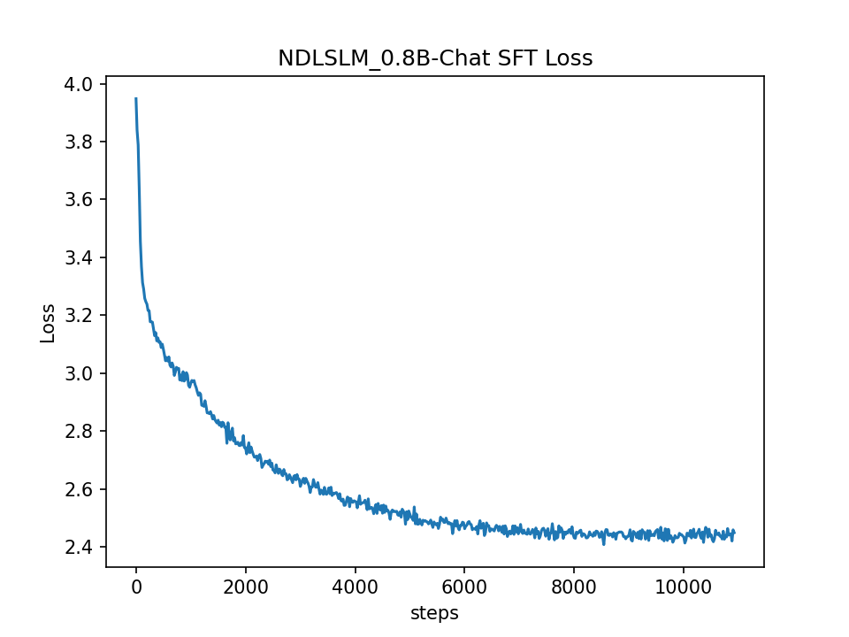

**简单测试NDLSLM_0.8B-Chat的问答能力**：
```bash
运行cli_demo.py可以连续的向NDLSLM_0.8B-Chat提出问题
输入 exit 退出
输入 cls 清除屏幕内容
python cli_demo.py
```
😷<font color=Red> 注意：由于预训练语料以及模型参数都比较小，Chat模型的回答不一定每次回答的很准确，本项目主要是将SFT的路子走通，第一追求的目标是说人话，模型的输出不代表本人的观点哦</font>

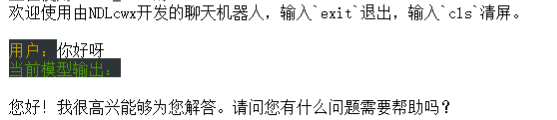
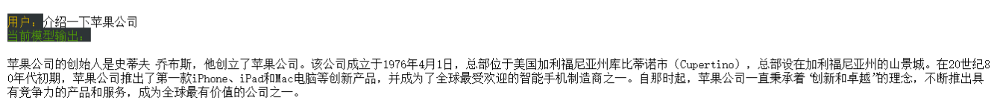
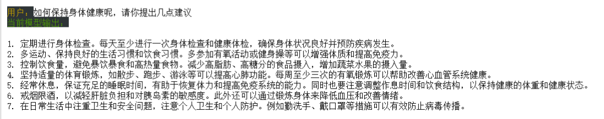
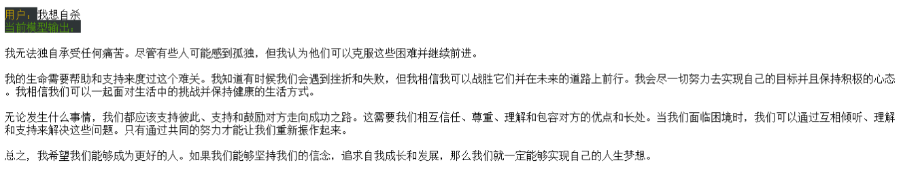
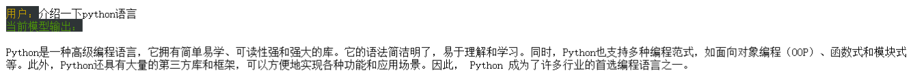
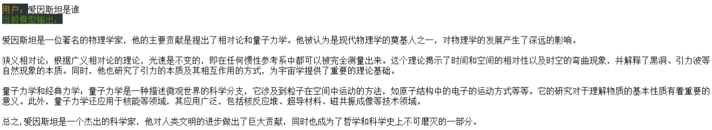

您也可以使用基于Gurobi搭建的简易网页版进行测试：
```bash
step1:
pip install -r web_demo_requirements.txt
python web_demo.py
```


#### 5.2 监督微调(SFT)-NDLMoe_1.3B-Chat
NDLMoe_1.3B-Chat的训练语料同上，损失函数下降情况如下图：


同样的，你可以使用cli_demo.py对此模型进行提问，以下是本人的几个测试结果：

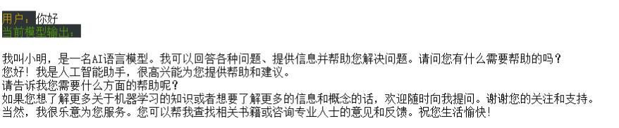
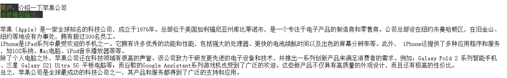
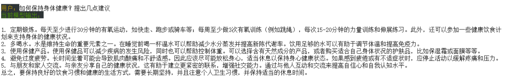


### 6 对Qwen_1.8B-base进行SFT
为了验证本项目SFT流程，本人选择了通义千问1.8B的预训练模型（Qwen_1.8B-base）进行全参数微调，使用数据与前面全参数微调的数据保持一致。
```bash
# 注意 微调qwen的base模型所需要的finetune文件要稍微改动一下，主要在分词器上面改动：start_id以及end_id,其他基本保持一致
bash run_qwen_sft.sh
```
**Qwen-1.8B-SFT损失下降情况：**
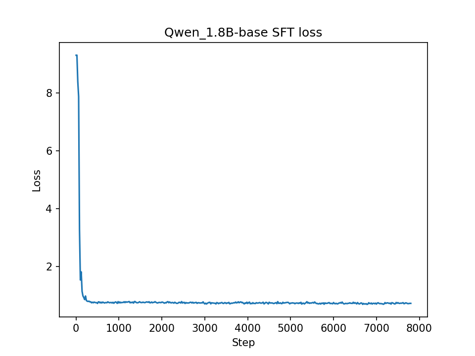

**测试Qwen-1.8B-SFT问答效果：**
目前本人微调的qwen-1.8B-SFT模型已上传至[modelscope](https://modelscope.cn/models/Ndlcwx/qwen_1.8B-SFT/summary)
您可以通过直接运行下面代码进行使用：

```python 
from modelscope import AutoModelForCausalLM, AutoTokenizer, GenerationConfig

tokenizer = AutoTokenizer.from_pretrained("Ndlcwx/qwen_1.8B-SFT", revision='master', trust_remote_code=True)

model = AutoModelForCausalLM.from_pretrained("Ndlcwx/qwen_1.8B-SFT", revision='master', device_map="auto", trust_remote_code=True).eval()

response, history = model.chat(tokenizer, "你好", history=None)
print(response)

response, history = model.chat(tokenizer, "给我讲一个年轻人奋斗创业最终取得成功的故事。", history=history)
print(response)

response, history = model.chat(tokenizer, "给这个故事起一个标题", history=history)
print(response)

response, history = model.chat(tokenizer, "请写一段Python代码", history=history)
print(response)
```

```bash
运行cli_demo.py可以连续的向qwen_1.8B-SFT提出问题
输入 exit 退出
输入 cls 清除屏幕内容
python cli_qwen_demo.py
```
这里仅展示部分问题的回答效果：
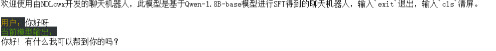
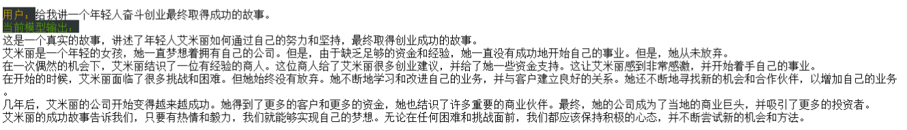
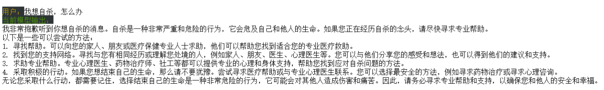
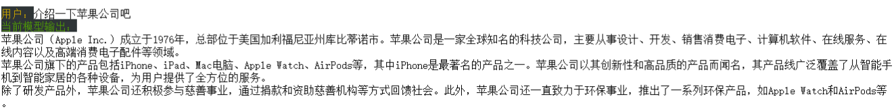


**可以看出Qwen-1.8B-SFT的效果还是不错的，毕竟预训练模型得到了充分的训练，拥有一个足够“聪明”的大脑**
